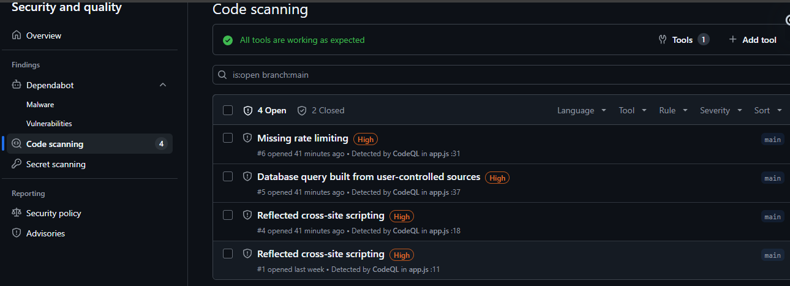
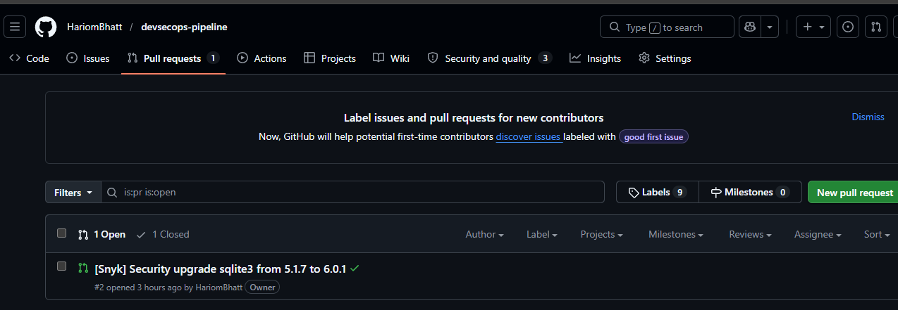

<div align="center">

# 🔐 DevSecOps Pipeline

### Automated Security Testing — SAST · SCA · DAST

[](https://github.com/HariomBhatt/devsecops-pipeline/actions)
[](https://codeql.github.com/)
[](https://snyk.io/)
[](https://www.zaproxy.org/)
[](https://nodejs.org/)
[](LICENSE)

<br/>

> A production-grade **DevSecOps pipeline** that shifts security left — catching vulnerabilities in code, dependencies, and running applications — all automated via GitHub Actions CI/CD.

</div>

---

## 📋 Table of Contents

- [Overview](#-overview)
- [Architecture](#-pipeline-architecture)
- [Tech Stack](#-tech-stack)
- [Project Structure](#-project-structure)
- [Setup & Installation](#-setup--installation)
- [Pipeline Stages](#-pipeline-stages)
  - [SAST — CodeQL](#-stage-1-sast--static-application-security-testing)
  - [SCA — Snyk / npm audit](#-stage-2-sca--software-composition-analysis)
  - [DAST — OWASP ZAP](#-stage-3-dast--dynamic-application-security-testing)
- [Findings & Fixes](#-security-findings--fixes)
- [Results Summary](#-results-summary)
- [Screenshots](#-screenshots)

---

## 🎯 Overview

This project implements a **fully automated, end-to-end DevSecOps pipeline** for a Node.js/Express application. It integrates three industry-standard security testing methodologies into a single GitHub Actions workflow — detecting vulnerabilities at every layer of the software delivery lifecycle.

| Testing Layer | What It Scans | When It Runs |
|:---|:---|:---|
| **SAST** | Source code for logic flaws & insecure patterns | On every `push` to `main` |
| **SCA** | Third-party dependencies for known CVEs | After SAST passes |
| **DAST** | Live running application for runtime vulnerabilities | After SCA passes |

---

## 🏗️ Pipeline Architecture

```
┌─────────────────────────────────────────────────────────┐
│                   GitHub Push to main                   │
└────────────────────────┬────────────────────────────────┘
                         │
                         ▼
          ┌──────────────────────────┐
          │     🔍 SAST — CodeQL     │
          │  Static code analysis    │
          │  XSS · SQLi · Rate Limit │
          └────────────┬─────────────┘
                       │  ✅ Pass
                       ▼
          ┌──────────────────────────┐
          │   📦 SCA — npm audit     │
          │  Dependency scan         │
          │  CVE detection · Snyk PR │
          └────────────┬─────────────┘
                       │  ✅ Pass
                       ▼
          ┌──────────────────────────┐
          │   🌐 DAST — OWASP ZAP   │
          │  Runtime vulnerability   │
          │  scan on live app        │
          └────────────┬─────────────┘
                       │
                       ▼
          ┌──────────────────────────┐
          │  📊 ZAP Report Artifact  │
          │  report.html / .json /   │
          │  .md uploaded to Actions │
          └──────────────────────────┘
```

---

## 🧰 Tech Stack

| Category | Tool / Technology |
|:---|:---|
| **Runtime** | Node.js 18 · Express.js |
| **Version Control** | Git · GitHub |
| **CI/CD** | GitHub Actions |
| **SAST** | GitHub CodeQL |
| **SCA** | npm audit · Snyk |
| **DAST** | OWASP ZAP (Docker) |
| **OS / Environments** | Windows (dev) · Kali Linux · Ubuntu (CI) |

---

## 📁 Project Structure

```
devsecops-pipeline/
│
├── .github/
│   └── workflows/
│       └── devsecops.yml        # 🔧 Full CI/CD pipeline definition
│
├── app.js                        # 🌐 Express application (intentionally vulnerable)
├── package.json
├── package-lock.json
│
├── report.html                   # 📊 ZAP DAST report (HTML)
├── report.json                   # 📊 ZAP DAST report (JSON)
├── report.md                     # 📊 ZAP DAST report (Markdown)
│
└── README.md
```

---

## ⚙️ Setup & Installation

### Prerequisites

- Node.js ≥ 18
- Git
- Docker (for local DAST)
- GitHub account with Actions enabled

### 1️⃣ Clone the Repository

```bash
git clone https://github.com/HariomBhatt/devsecops-pipeline.git
cd devsecops-pipeline
```

### 2️⃣ Install Dependencies

```bash
npm install
```

### 3️⃣ Run the Application

```bash
node app.js
# Server running on http://localhost:3000
```

### 4️⃣ Push to GitHub to Trigger the Pipeline

```bash
git add .
git commit -m "feat: trigger devsecops pipeline"
git push origin main
```

> The GitHub Actions workflow will automatically execute **SAST → SCA → DAST** in sequence.

---

## 🔄 Pipeline Stages

### 🔍 Stage 1: SAST — Static Application Security Testing

**Tool:** [GitHub CodeQL](https://codeql.github.com/)

CodeQL performs deep semantic analysis of the JavaScript source code, building a queryable database of the codebase and running security queries against it.

**Workflow snippet:**

```yaml
SAST:
  runs-on: ubuntu-latest
  steps:
    - uses: actions/checkout@v3
    - uses: github/codeql-action/init@v3
      with:
        languages: javascript
    - uses: github/codeql-action/analyze@v3
```

**Vulnerabilities Detected (4 Open):**

| # | Alert | Severity | Location |
|:--|:------|:--------:|:---------|
| 1 | Reflected Cross-Site Scripting | 🔴 **High** | `app.js:11` |
| 2 | Reflected Cross-Site Scripting | 🔴 **High** | `app.js:18` |
| 3 | Database Query from User-Controlled Sources | 🔴 **High** | `app.js:37` |
| 4 | Missing Rate Limiting | 🔴 **High** | `app.js:31` |

---

### 📦 Stage 2: SCA — Software Composition Analysis

**Tools:** [npm audit](https://docs.npmjs.com/cli/v10/commands/npm-audit) · [Snyk](https://snyk.io/)

Scans all third-party dependencies against known CVE databases. Snyk auto-generates a pull request to upgrade vulnerable packages.

**Workflow snippet:**

```yaml
SCA:
  runs-on: ubuntu-latest
  needs: SAST
  steps:
    - uses: actions/checkout@v3
    - uses: actions/setup-node@v3
      with:
        node-version: 18
    - run: npm install
    - run: npm audit || true
```

**Vulnerability Found:**

| Package | Vulnerable Version | Fixed Version | PR |
|:--------|:-----------------:|:-------------:|:---|
| `sqlite3` | `5.1.7` | `6.0.1` | [Snyk PR #2](https://github.com/HariomBhatt/devsecops-pipeline/pull/2) ✅ |

---

### 🌐 Stage 3: DAST — Dynamic Application Security Testing

**Tool:** [OWASP ZAP](https://www.zaproxy.org/) (Baseline Scan via Docker)

ZAP spiders and actively probes the **live running application** on `http://127.0.0.1:3000`, simulating real-world attack patterns and detecting runtime misconfigurations.

**Workflow snippet:**

```yaml
DAST:
  runs-on: ubuntu-latest
  needs: SCA
  steps:
    - run: |
        node app.js &
        sleep 15
    - name: Run OWASP ZAP Scan
      run: |
        docker run --rm \
          --network="host" \
          --user root \
          -v $(pwd):/zap/wrk/:rw \
          ghcr.io/zaproxy/zaproxy:stable \
          zap-baseline.py \
          -t http://127.0.0.1:3000 \
          -r report.html \
          -w report.md \
          -J report.json \
          -I
    - name: Upload ZAP Report
      uses: actions/upload-artifact@v4
      with:
        name: zap-report
        path: report.html, report.md, report.json
```

**Vulnerabilities Found:**

| Risk Level | Alert | Description |
|:----------:|:------|:------------|
| 🔴 **Medium** | CSP Failure — No Fallback Directive | Content Security Policy is missing fallback rules |
| 🔴 **Medium** | Content Security Policy Header Not Set | No `Content-Security-Policy` header present |
| 🔴 **Medium** | Missing Anti-Clickjacking Header | No `X-Frame-Options` to prevent clickjacking |
| 🟡 **Low** | Cross-Origin-Embedder-Policy Missing | COEP header absent |
| 🟡 **Low** | Cross-Origin-Opener-Policy Missing | COOP header absent |
| 🟡 **Low** | Cross-Origin-Resource-Policy Missing | CORP header absent |
| 🟡 **Low** | Permissions Policy Header Not Set | Feature permissions not declared |
| 🟡 **Low** | Server Info Leak via `X-Powered-By` | Exposes Express.js version info |
| 🟡 **Low** | X-Content-Type-Options Header Missing | MIME-sniffing attacks possible |
| ℹ️ **Info** | Storable and Cacheable Content | Responses cached without explicit directives |

---

## 🔧 Security Findings & Fixes

### Fix 1 — XSS (Reflected Cross-Site Scripting)

```js
// ❌ Vulnerable — User input reflected directly into response
app.get("/search", (req, res) => {
  const q = req.query.q;
  res.send("Search: " + q);
});

// ✅ Fixed — Encode output before sending
app.get("/search", (req, res) => {
  const q = req.query.q;
  res.send("Search: " + encodeURIComponent(q));
});
```

### Fix 2 — Vulnerable Dependency (sqlite3)

```bash
# ❌ Vulnerable version pinned in package.json
"sqlite3": "5.1.7"

# ✅ Upgrade via Snyk auto-PR or manually
npm install sqlite3@latest
npm audit fix
```

### Fix 3 — Missing Security Headers (DAST)

```js
// ✅ Add all required security headers via middleware
app.disable("x-powered-by");

app.use((req, res, next) => {
  res.setHeader("X-Frame-Options", "DENY");
  res.setHeader("X-Content-Type-Options", "nosniff");
  res.setHeader("Permissions-Policy", "geolocation=()");
  res.setHeader("Content-Security-Policy", "default-src 'self'");
  res.setHeader("Cross-Origin-Embedder-Policy", "require-corp");
  res.setHeader("Cross-Origin-Opener-Policy", "same-origin");
  res.setHeader("Cross-Origin-Resource-Policy", "same-origin");
  next();
});
```

---

## 📊 Results Summary

| Phase | Tool | Findings | Status |
|:------|:-----|:--------:|:------:|
| **SAST** | CodeQL | 4 High (XSS × 2, SQLi, Rate Limiting) | 🔴 Open |
| **SCA** | npm audit + Snyk | 1 Critical (`sqlite3` CVE) | 🟡 PR Raised |
| **DAST** | OWASP ZAP | 3 Medium, 6 Low, 1 Info | 🟡 Documented |

---

## 📸 Screenshots

### 🔍 SAST — CodeQL Findings (GitHub Security Tab)

> 4 High-severity alerts detected across `app.js` — including Reflected XSS, SQL Injection via user-controlled input, and missing rate limiting.



---

### 📦 SCA — Snyk Security Upgrade PR

> Snyk automatically raised Pull Request #2 to upgrade `sqlite3` from `5.1.7` → `6.0.1`, resolving a known critical vulnerability.



---

### 🌐 DAST — OWASP ZAP Scan Report

> ZAP baseline scan against the live running application detected **10 alerts** including missing CSP headers, clickjacking exposure, and server information leakage.

> 📄 Full ZAP Markdown report is available directly in this repository: **[`DAST_zap_report.md`](DAST_zap_report.md)**
>
> 📥 Full ZAP HTML/JSON report also available as a GitHub Actions Artifact: **`zap-report`** (`report.html`, `report.json`, `report.md`)

---

## 🙌 Author

**Hariom Bhatt**
- GitHub: [@HariomBhatt](https://github.com/HariomBhatt)

---

<div align="center">

**⭐ If this project helped you, consider giving it a star!**

*Built with 🔐 security-first thinking*

</div>
